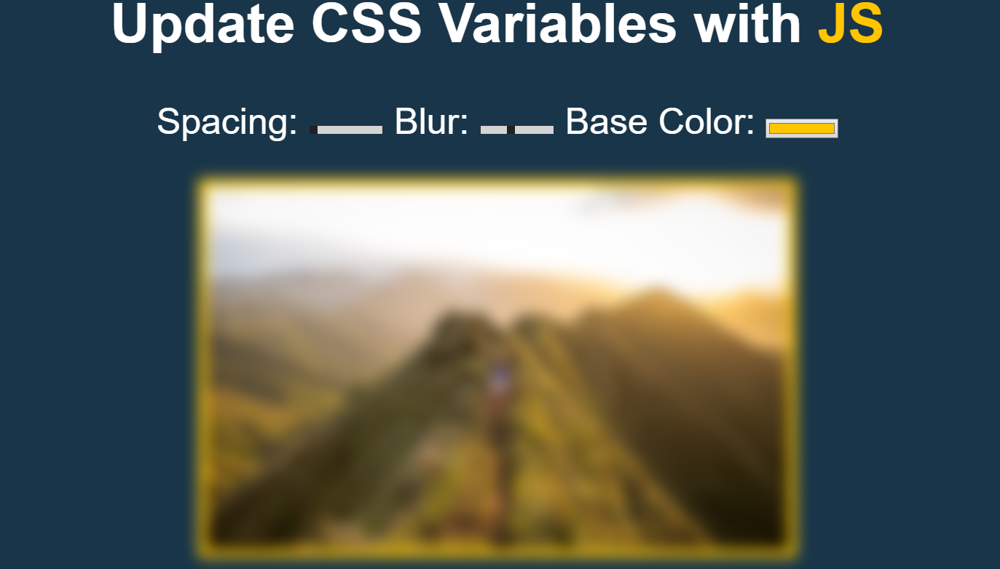

# Projeto CSS Variables com JavaScript

## Um simples projeto utilizando CSS Variables e Javascript.

### 📱 Como funciona o projeto?      

Basicamente o projetos consiste em fazer com que o JavaScript encontre as propriedades e os parametros passados a ele, e alteros de forma que o usuario escolha.

Como o Spacing, Blur, Base Color.

